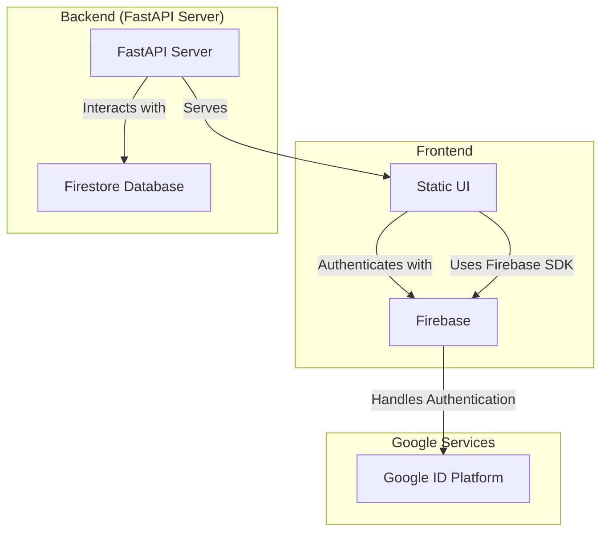

# Cloud Run App with OAuth2 and Firestore

---

## Overview
In this assignment we will build a web application that has authentication and
authorization, a service layer that serves a UI and interacts with a data
store, and a persistent data storage layer.

The web application allows users to vote on the long disputed Tabs vs Spaces
problem. Users can login and make their voice heard! 
 
You will deploy the web server on **Google Cloud Run**, use **Google Cloud Identity Platform** for OAuth2 authentication, and **Firestore** for handling user data and application-related information.

---

### YOUR APPLICATION URL HERE!

---

## Docs
- [backend](docs/python-backend.md)
- [client](docs/client-side-js.md)
- [firestore](docs/firestore.md)
- [cloud run](docs/cloud-run.md)
- [oauth2](docs/oauth2.md)


## Architecture



## Addition Docs


## Technologies Used
- **FastAPI**: Python-based web framework for serving HTML and handling API requests
- **Google Cloud Identity Platform**: Manages OAuth2 authentication and user sign-ins
- **Firestore**: NoSQL database for storing application data and login information
- **Google Cloud Run**: Runs and deploys the FastAPI web server
- **Firestore Emulator**: Used for local development to simulate Firestore behavior
- **Vanilla JavaScript**: Handles client-side interactions and posts data to the API
- **Docker & Docker Compose**: Used for containerized local development

## Local Development Setup
The project is already set up to run with Docker Compose. The setup includes:
- A FastAPI web server running in a container (`vote` service)
- A Firestore emulator running in a container (`db` service)
- Authentication can be disabled in local mode by passing `auth=false` as a query parameter

### Running Locally
1. **Clone the repository**
   ```sh
   git clone <repository_url>
   cd <project_directory>
   ```

## Local development setup
We are using docker compose to run the FastAPI server and Firestore emulator locally. The compose file is mounting the `./cc_cloud_run` directory to the `/app` directory in the container, so you can start the compose stack and start developing.

__**note: you can run the application without authentication by adding `?auth=false` to the query parameters**__

1. **Start the application using Docker Compose**
   ```sh
   docker compose up --build
   ```

2. **Access the application**
   - FastAPI Server: [http://localhost:9080](http://localhost:9080)
   - Firestore Emulator: [http://localhost:8080](http://localhost:8080)
   - Disable authentication by adding `?auth=false` to the query parameters

## Rubric (Total: 15 Points)
| Criteria                                                        | Points |
|-----------------------------------------------------------------|--------|
| OAuth2 login works using Google Identity Platform               | 5 pts  |
| Web server works with client-side JavaScript posting to backend | 5 pts  |
| Web server client-side event listeners                          | 3 pts  |
| Firestore is correctly set up and used for data storage         | 2 pts  |

## Submission
1. **GitHub Repository:**
- Ensure your project is in a **GitHub repository**.
- The repository should include all necessary files (`main.py`, `Dockerfile`, `docker-compose.yml`, `index.html`, `requirements.txt`, etc.).

2. **Deployment:**
- Deploy your FastAPI server to **Google Cloud Run**.
- Ensure your **Firestore database** is properly configured and accessible by the application.

3. **README File:**
- **Update this README with your application URL**
  - i.e. `https://tabs-vs-spaces-XXXXXX.us-central1.run.app/`

4. **Submit Zip file Canvas:**
- Cloud Run Logs, Screenshots (Firestore, and Identity Platflow)
  - screenshot need to include your URL and Project ID
